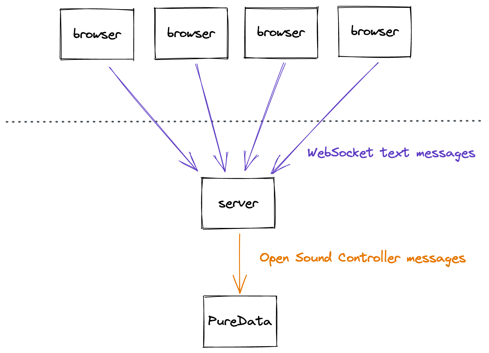

# HACKING ON THE SYSTEM

Hello! This is the README.md file for my computer music piece "hacking the music", in which four performers control four different "instruments" via a 90s hacker inspired interface.

The 4 instruments are:

1. Bass--what it says on the tin
2. Drums--sample-based polyphonic drum machine
3. Pads--polyphonic chord based pads
4. Atmosphere--samples, a "modem" synth

## Tech

### web/

This directory has the code for the "hacking station" server/website, which performers use to control their instruments. Input is provided primarily through the both the main textbox on the left-hand side of the screen, and the graphical canvas on the right-hand side of the screen.

The architecture of my project means that all audio comes out of one instance of the "main" Pd patch (which contains master mixing options). Performers connect via their browser, each one in the same interface with the same commands available to them. Their browser connects to an intermediary server which decodes their commands into OSC messages, which are then distributed to Pd.

#### 

#### How to start the things

1. Open Pd, and oblong.pd
2. Run index.js (`$ node index.js`)
3. Open the page in your browser (http://localhost:3000).

### pd/

This directory has the pd "server" which actually makes sounds. It's built up a bunch of different patches, the main one is oblong.pd.

- oblong.pd
- glitch~.pd
- scheduler.pd
- sequencer-32.pd
- calm.synth.pd
- hacker.synth.pd (and hacker.synth.cl)
- sampler.pd
- sampler.cl.pd

Various samples are used throughout these patches, which can be found in the "pd/samples".

#### Theory

## "Composition"

When I was designing this piece I wanted to make sure there was a plan, but not too strict of a plan.